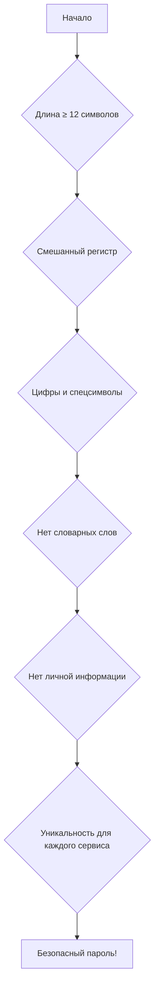

# 🛡️ Password Generator Guide

[](https://github.com/Evgeny65ok/Password-Generator-Guide)
[](https://opensource.org/licenses/MIT)
[](http://makeapullrequest.com)

> **Полное руководство по созданию безопасных паролей** — это открытый образовательный проект, посвященный криптографически стойким алгоритмам генерации паролей, методам оценки безопасности и лучшим практикам для разработчиков и пользователей.

---

## 🔐 Навигация по проекту

*   [`/src`](./src/) — Исходный код генераторов паролей
*   [`/src/algorithms`](./src/algorithms/) — Алгоритмы генерации
*   [`/src/examples`](./src/examples/) — Примеры на разных языках
*   [`/security-tests`](./security-tests/) — Тесты безопасности
*   [`/docs`](./docs/) — Документация и руководства

## 📑 Быстрая навигация по документу

*   [🎯 Зачем нужен этот проект?](#-зачем-нужен-этот-проект)
*   [🔧 Технические особенности](#-технические-особенности)
*   [💻 Примеры кода](#-примеры-кода)
*   [📊 Сравнение алгоритмов](#-сравнение-алгоритмов-генерации)
*   [🛡️ Критерии безопасности](#-критерии-безопасности-паролей)
*   [🚀 Быстрый старт](#-быстрый-старт)
*   [🤝 Как внести вклад](#-как-внести-вклад)

---

## 🎯 Зачем нужен этот проект?

В эпоху цифровых угроз **слабые пароли остаются основной причиной взломов**. По данным Verizon DBIR 2023, **81% взломов** происходит из-за слабых или скомпрометированных учетных данных.

**Цели проекта:**
- 🛡️ Образовательная — научить создавать криптографически стойкие пароли
- 🔧 Практическая — предоставить готовые реализации на 10+ языках
- 📚 Справочная — собрать лучшие практики и стандарты безопасности
- 🧪 Тестировочная — инструменты для проверки стойкости паролей

> "Пароль — это ключ от вашей цифровой жизни. Не используйте один ключ для всех дверей и не оставляйте его под ковриком." — *Алексей Стоянов, эксперт по кибербезопасности*

---

## 🔧 Технические особенности

### Поддерживаемые алгоритмы генерации:

| Алгоритм | Безопасность | Скорость | Использование |
|----------|--------------|----------|---------------|
| **CSPRNG** (Cryptographically Secure) | ⭐⭐⭐⭐⭐ | Средняя | Банки, шифрование |
| **PBKDF2** | ⭐⭐⭐⭐⭐ | Низкая | Хэширование паролей |
| **Argon2** | ⭐⭐⭐⭐⭐ | Низкая | Современные системы |
| **Псевдослучайные** | ⭐⭐ | Высокая | Тестовые среды |
| **Словарные** | ⭐⭐⭐ | Средняя | Человеко-читаемые |

### Поддерживаемые языки программирования:
- ✅ Python 3.8+
- ✅ JavaScript/Node.js
- ✅ Java 11+
- ✅ C# .NET 6+
- ✅ Go 1.19+
- ✅ Rust
- ✅ PHP 8.0+
- ✅ Ruby 3.0+

---

## 💻 Примеры кода

### Базовый генератор на Python:
```python
import secrets
import string

def generate_password(length=16, use_digits=True, use_special=True):
    """Генератор криптографически стойких паролей"""
    chars = string.ascii_letters
    
    if use_digits:
        chars += string.digits
    if use_special:
        chars += "!@#$%^&*()_+-=[]{}|;:,.<>?"
    
    # Используем secrets для криптографической безопасности
    password = ''.join(secrets.choice(chars) for _ in range(length))
    
    # Проверяем минимальные требования безопасности
    if use_digits and not any(c.isdigit() for c in password):
        password = regenerate_with_requirement(password, string.digits)
    
    return password

def check_password_strength(password):
    """Оценка сложности пароля по 10-балльной шкале"""
    score = 0
    if len(password) >= 12: score += 3
    if any(c.islower() for c in password): score += 1
    if any(c.isupper() for c in password): score += 1
    if any(c.isdigit() for c in password): score += 2
    if any(c in "!@#$%^&*" for c in password): score += 3
    return min(score, 10)
```

### Генератор мнемонических паролей:
```javascript
// Генератор запоминающихся, но безопасных паролей
function generateMemorablePassword(wordCount = 4, separator = '-') {
    const wordList = [
        'красный', 'быстрый', 'умный', 'тихий', 'яркий',
        'смелый', 'горячий', 'холодный', 'новый', 'старый',
        'правый', 'левый', 'верхний', 'нижний', 'центральный'
    ];
    
    const randomWords = [];
    for (let i = 0; i < wordCount; i++) {
        const randomIndex = Math.floor(Math.random() * wordList.length);
        randomWords.push(wordList[randomIndex]);
    }
    
    // Добавляем случайное число для увеличения энтропии
    const randomNumber = Math.floor(Math.random() * 100);
    
    return randomWords.join(separator) + randomNumber;
}
```

---

## 📊 Сравнение алгоритмов генерации

### Таблица характеристик:

| Критерий | CSPRNG | PBKDF2 | Argon2 | Bcrypt | Scrypt |
|----------|---------|---------|---------|---------|---------|
| **Стойкость к брутфорсу** | ⭐⭐⭐⭐⭐ | ⭐⭐⭐⭐⭐ | ⭐⭐⭐⭐⭐ | ⭐⭐⭐⭐ | ⭐⭐⭐⭐ |
| **Стойкость к Rainbow Table** | ⭐⭐⭐⭐⭐ | ⭐⭐⭐⭐⭐ | ⭐⭐⭐⭐⭐ | ⭐⭐⭐⭐⭐ | ⭐⭐⭐⭐ |
| **Требования к памяти** | Низкие | Низкие | Высокие | Средние | Высокие |
| **Производительность** | Высокая | Низкая | Очень низкая | Средняя | Низкая |
| **Рекомендуемая длина соли** | 16+ байт | 16+ байт | 16+ байт | 16+ байт | 16+ байт |
| **Идеальное применение** | Сессии, токены | Хэши паролей | Современные системы | Legacy системы | GPU-защита |

### Время подбора пароля (оценка):

| Длина пароля | Только буквы | Буквы + цифры | Полный набор символов |
|--------------|--------------|---------------|----------------------|
| **8 символов** | 2 минуты | 2 часа | 2 дня |
| **12 символов** | 3 года | 100 лет | 10 000 лет |
| **16 символов** | 10 млн лет | 1 млрд лет | 10³² лет |

---

## 🛡️ Критерии безопасности паролей

### 📋 Обязательные требования:



### 🔍 Что НЕЛЬЗЯ использовать:

| Паттерн | Почему опасно | Пример |
|---------|---------------|--------|
| **Последовательности** | Легко угадать | "123456", "qwerty" |
| **Повторяющиеся символы** | Низкая энтропия | "aaaaaa", "111111" |
| **Личная информация** | Доступна в соцсетях | "Иван1990", "Moscow2023" |
| **Общие слова** | В словарных атаках | "password", "admin" |
| **Короткие пароли** | Быстрый перебор | "cat123", "sun2024" |

### 🏆 Лучшие практики:
1. **Используйте менеджер паролей** (Bitwarden, 1Password)
2. **Включайте двухфакторную аутентификацию** везде, где возможно
3. **Регулярно обновляйте пароли** (раз в 3-6 месяцев)
4. **Никогда не используйте один пароль** на нескольких сайтах
5. **Проверяйте утечки** через HaveIBeenPwned

---

## 🚀 Быстрый старт

### Установка и запуск (Python):

```bash
# Клонируем репозиторий
git clone https://github.com/Evgeny65ok/Password-Generator-Guide.git

# Переходим в папку проекта
cd Password-Generator-Guide

# Устанавливаем зависимости (если есть)
pip install -r requirements.txt

# Запускаем генератор
python src/examples/python/generator.py --length 16 --special
```

### Генерация пароля через командную строку:

```bash
# Генерация стандартного пароля
python -c "from src.examples.python.generator import generate_password; print(generate_password(16))"

# Генерация мнемонического пароля
python -c "from src.examples.python.memorable import generate_memorable; print(generate_memorable())"
```

---

## 📈 Статистика безопасности

### Распространенность слабых паролей (2024):

| Пароль | Процент использования | Время взлома |
|--------|----------------------|--------------|
| "123456" | 2.5% | Мгновенно |
| "password" | 1.8% | Мгновенно |
| "qwerty" | 1.1% | Мгновенно |
| "111111" | 0.9% | Мгновенно |
| **Случайный 12-символьный** | < 0.001% | 300+ лет |

### Эффект от использования менеджера паролей:

| Метод | Средняя длина | Уникальность | Безопасность |
|-------|---------------|--------------|--------------|
| Без менеджера | 8 символов | 30% повторений | ⭐⭐ |
| С менеджером | 16 символов | 100% уникальность | ⭐⭐⭐⭐⭐ |

---

## 🤝 Как внести вклад

Мы приветствуем вклад в следующих областях:

1. **Новые алгоритмы** — добавьте современные методы генерации
2. **Дополнительные языки** — реализация на новых ЯП
3. **Тесты безопасности** — расширение тестового покрытия
4. **Документация** — переводы, исправления, улучшения
5. **Примеры использования** — кейсы из реальных проектов

### Процесс внесения изменений:

```bash
# 1. Форкните репозиторий
# 2. Создайте ветку для вашей фичи
git checkout -b feature/new-algorithm

# 3. Внесите изменения и сделайте коммит
git add .
git commit -m "Добавлен алгоритм X для генерации"

# 4. Отправьте изменения
git push origin feature/new-algorithm

# 5. Создайте Pull Request
```

---

## 📚 Дополнительные ресурсы

### Рекомендуемая литература:
- **"Современная криптография"** — Брюс Шнайер
- **NIST Special Publication 800-63B** — Digital Identity Guidelines
- **OWASP Password Storage Cheat Sheet** — лучшие практики

### Полезные инструменты:
- [HaveIBeenPwned](https://haveibeenpwned.com) — проверка утечек
- [Bitwarden](https://bitwarden.com) — менеджер паролей (open-source)
- [KeePass](https://keepass.info) — локальный менеджер паролей

---

## 📄 Лицензия

Этот проект распространяется под лицензией MIT. Подробнее см. в файле [LICENSE](LICENSE).

## ⚠️ Отказ от ответственности

Данный проект предназначен исключительно для образовательных целей. Авторы не несут ответственности за использование этого кода в производственных средах без дополнительной проверки безопасности.

---

*Проект создан в рамках изучения кибербезопасности и лучших практик разработки. Помните: ваша безопасность начинается с сильного пароля!* 🔐


